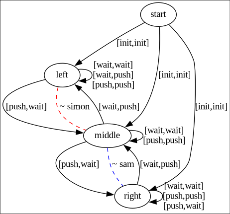

# MAGIIAN tools

## Game representation

```prolog
% Here is an example of how "the wagon game" would be representated

% a list of the agents that are playing
agents([simon, sam]).

% The initial location
initial(start).

% delta - these implicitly define
% * locations in the game
% * actions in the game
% * actions for each agent
% from start
transition(start, [init, init], left).
transition(start, [init, init], middle).
transition(start, [init, init], right).
% from left
transition(left, [wait, wait], left).
transition(left, [wait, push], left).
transition(left, [push, push], left).
transition(left, [push, wait], middle).
% from middle
transition(middle, [wait, wait], middle).
transition(middle, [wait, push], left).
transition(middle, [push, push], middle).
transition(middle, [push, wait], right).
% from right
transition(right, [wait, wait], right).
transition(right, [wait, push], middle).
transition(right, [push, push], right).
transition(right, [push, wait], right).

%% equivalence relations, signifies that the locations
% here are equal regarding to an agent
equal(simon, [left, middle]).
equal(sam, [middle, right]).
```

Internaly the games are represented a little differently. The above game would
look like this when viewed.



## dependencies

* [swipl](https://www.swi-prolog.org/)
* [Graphviz](https://graphviz.org/)
* [prolog_graphviz](https://github.com/wouterbeek/prolog_graphviz)

## some useful commands / predicates

* Start the program with `swipl main.pl`.
* Load a game from the `games` directory with `load_game/1`. For example `?-
  load_game(wagon_game)`.
* Create an mkbsc-expansion of a game with `create_expanded_game/2`. For example
  `?- create_expanded_game(wagon_game, 3)` (this would create all expansions of
  that game up to 3).
* View a game with `view_game/2`. For example `?- view_game(wagon_game, 0)` to view
  the original version of that game, or `?- view_game(wagon_game, 2)` to view that
  game expanded 2 times with mkbsc. (I have only tested this on linux).
* Export an image of a game with `export_game/2`. This works the same as
  `view_game/2` but instead of opening a window with a picure of that game, an
  image is created.
