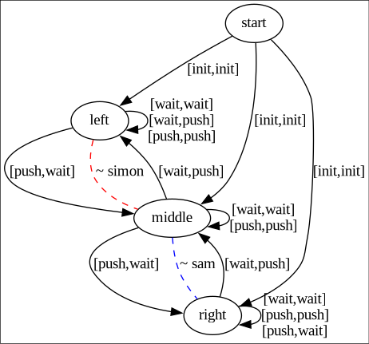
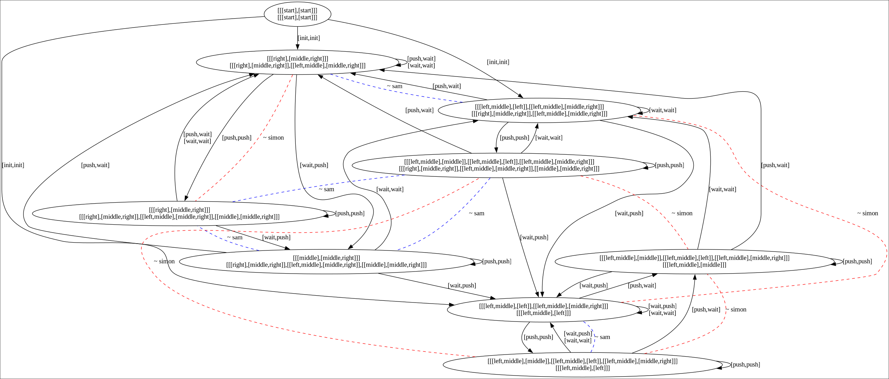
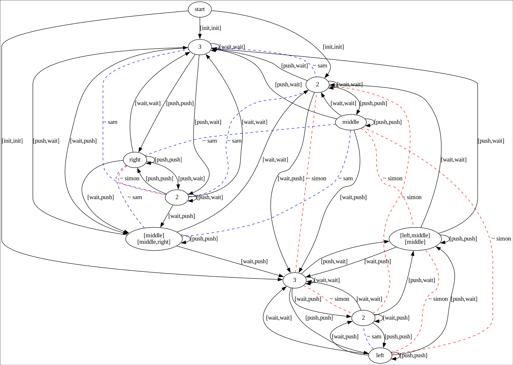
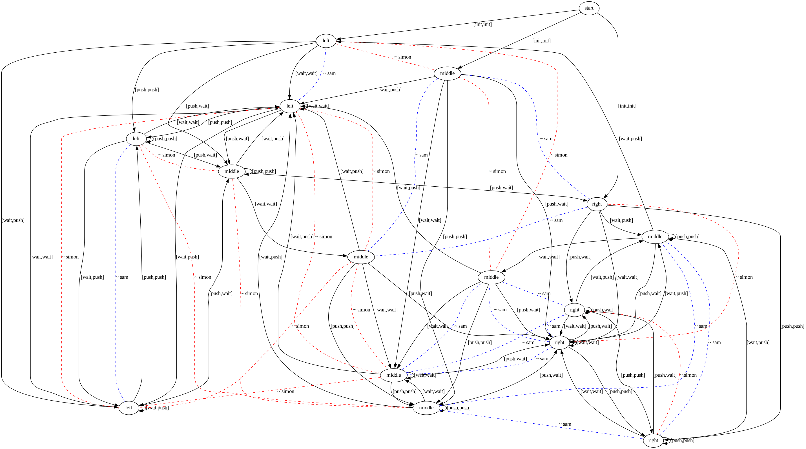

# MAGIIAN tools

## Internal structure
To get a better understanding of how to use the internal predicates, we refer to [NOTES.md](./NOTES.md). 

## Export outcomes as lists
This functionality was programmed into a seperate file [outcome_test.pl](outcome_test.pl), which means that you have to load both `main.pl` and `outcome_test.pl` to use it:
```console
$ swipl main.pl outcome_test.pl
```


To export the unique outcomes of a game `G` at each knowledge-level up to `K_max`, use:
```prolog
export_outcomes_as_locations(G, K_max).
``` 
This will output into the `outcomes/` folder.

## Game representation

```prolog
% Here is an example of how "the wagon game" would be representated

% a list of the agents that are playing
agents([simon, sam]).

% The initial location
initial(start).

% delta - these implicitly define
% * locations in the game
% * actions in the game
% * actions for each agent
% from start
transition(start, [init, init], left).
transition(start, [init, init], middle).
transition(start, [init, init], right).
% from left
transition(left, [wait, wait], left).
transition(left, [wait, push], left).
transition(left, [push, push], left).
transition(left, [push, wait], middle).
% from middle
transition(middle, [wait, wait], middle).
transition(middle, [wait, push], left).
transition(middle, [push, push], middle).
transition(middle, [push, wait], right).
% from right
transition(right, [wait, wait], right).
transition(right, [wait, push], middle).
transition(right, [push, push], right).
transition(right, [push, wait], right).

%% equivalence relations, signifies that the locations
% here are equal regarding to an agent
equal(simon, [left, middle]).
equal(sam, [middle, right]).
```

Internaly the games are represented a little differently. The above game would
look like this when viewed.



## dependencies

* [swipl](https://www.swi-prolog.org/)
* [Graphviz](https://graphviz.org/)
* [prolog_graphviz](https://github.com/wouterbeek/prolog_graphviz)

## some useful commands / predicates

* Start the program with `swipl main.pl`.
* Load a game from the `games` directory with `load_game/1`. For example `?-
  load_game(wagon_game)`.
* Create an mkbsc-expansion of a game with `create_expanded_game/2`. For example
  `?- create_expanded_game(wagon_game, 3)` (this would create all expansions of
  that game up to 3).
* View a game with `view_game/2`. For example `?- view_game(wagon_game, 0)` to view
  the original version of that game, or `?- view_game(wagon_game, 2)` to view that
  game expanded 2 times with mkbsc. (I have only tested this on linux).
* There is a better way to view larger expansions of a game with `view_game/3`.
  For example `view_game(wagon_game, 3, 1)` to view the third expansion of that
  game and only show the names of the locations that first occur in the original
  or first expansion of the game. One can also supply the term `actual` as the
  third parameter and get the names of the actual locations that the
  knowledge-states correspond to.
* Export an image of a game with `export_game/2`. This works the same as
  `view_game/2` but instead of opening a window with a picure of that game, an
  image is created. The images are placed in the `images` directory.
* One can also export the 'fancier' version of a game with `export_game/3`
  (works the same as `view_game/3`).

## visualizing games

Here are some examples of visualizations of games using different settings.
Before trying these commands, make sure to run the following to load and expand
the game.

```prolog
?- load_game(wagon_game).
  true
?- create_expanded_game(wagon_game, 10).
```

To view the original game type
```prolog
?- view_game(wagon_game, 0).
```


To view an expanded (here we view the second expansion) version of a game with
the default viewing settings. Notice how long the names of the nodes get.
```prolog
?- view_game(wagon_game, 2).
```


To view an expanded version of a game in a more user friendly way, try this.
Here we supply a **cutoff** so that nodes that occur for the first time after
this expansion are named after the expansion that they occur in for the first
time instead. These graphs are a little easier to grasp. For large expansions
they might still take a long time to load.
```prolog
?- view_game(wagon_game, 3, 1).
```


To view an expanded version of a game but with the locaitons named after
the actual nodes they correspond with in the original game, do this.
```prolog
?- view_game(wagon_game, 4, actual).
```

